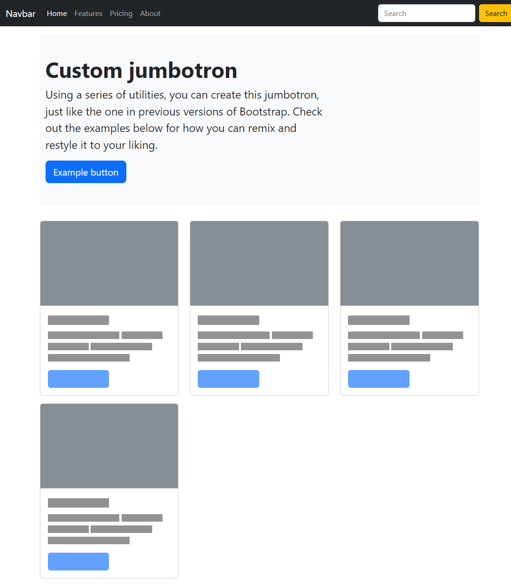

# Exercice: CSS Bootstrap

Ouvrir le projet dans [codesanbox.io](https://codesandbox.io/s/github/bfritscher/cours-html-exercices/tree/master/CSS_Bootstrap)

A l'aide des fichiers et informations fournies on vous demande de finir le site pour ressembler au résultat voulut.

- Compéter le ficher index.html
- Utiliser les exemples de la documentation Bootstrap.
- On veut deux colonnes en taille moyenne, et trois colonnes en large.
- Gutter et marges sont de `3`

Le résultat final doit ressembler à:

