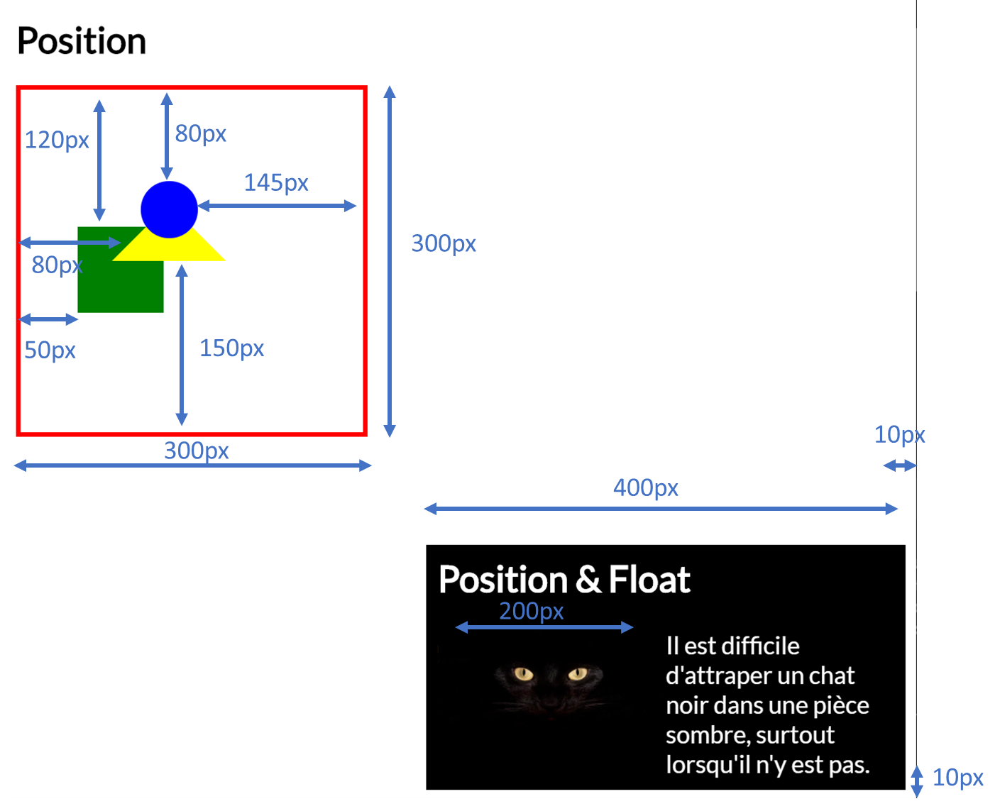

# Exercice: CSS Position & Float

Ouvrir le projet dans [codesanbox.io](https://codesandbox.io/s/github/bfritscher/cours-html-exercices/tree/master/CSS_Position)

Compéter le ficher style.css sans modifier le HTML dans index.html

Ecrire les règles CSS pour retrouver l'état final en suivant les indications de postition.

**SANS MODIFIER le code HTML!**

Utiliser: les concepts de position, float, width, height, z-index, top, left, bottom, right.

Après avoir validé votre syntaxe HTML avec https://validator.w3.org/ et CSS avec https://jigsaw.w3.org/css-validator/ vous pouvez valider l'exercice sur https://html.bf0.ch/#position .