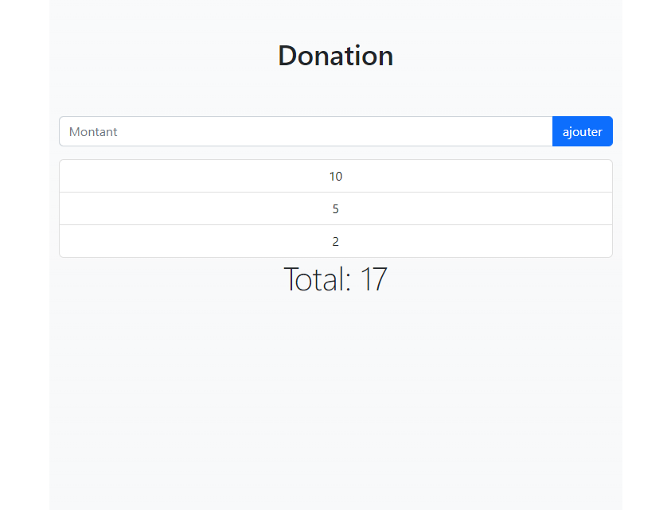

# Exercice: Ski Club (HTML Formulaire)

Ouvrir le projet dans [codesanbox.io](https://codesandbox.io/s/github/bfritscher/cours-html-exercices/tree/master/DOM_JS_DONATIONS)

A l'aide des fichiers et informations fournies on vous demande de finir le site pour ressembler au résultat voulut.

Le code HTML / CSS est donnée, à vous de compléter UNIQUEMENT la partie JavaScript. Pour vous aider voici quelques informations supplémentaires:

- On veut que quand on appuie sur le bouton "ajouter" le montant entrée dans le champ de saisie soit ajouté au total et affiché dans la liste.
- Le script doit s'exécuter quand la page est prête.
- Il faut ajouter une balise `li` avec la classe `liste-group-item` pour respecter les conventions bootstrap.
- Après avoir ajouté un montant, il faut que le champ soit à nouveau vide.
- Bonus: ajouter uniquement des elements si le montant est un chiffre.

Le résultat final doit ressembler à:

 

Vous pouvez valider l'exercice sur https://html.bf0.ch/#donations .
