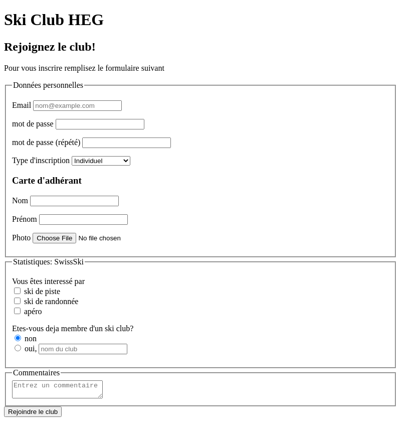
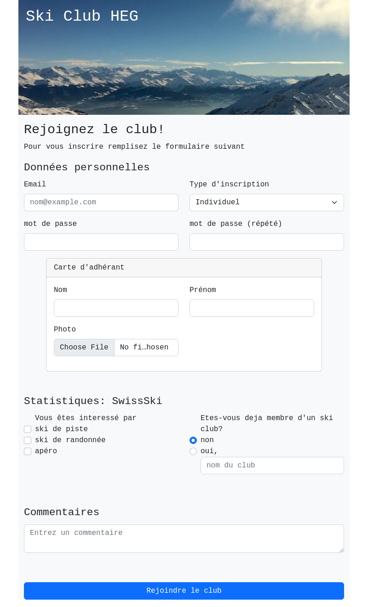

# Exercice: Ski Club (HTML Formulaire)

[](https://codesandbox.io/s/github/bfritscher/cours-html-exercices/tree/master/HTML_Form_SkiClub)


Ouvrir le projet dans [codesanbox.io](https://codesandbox.io/s/github/bfritscher/cours-html-exercices/tree/master/HTML_Form_SkiClub_bootstrap)

A l'aide des fichiers et informations fournies on vous demande de finir le site pour ressembler au résultat voulut.

Une partie du HTML et CSS est donnée, à vous de compléter. Pour vous aider voici quelques informations supplémentaires:

### Partie Formulaire

- Le formulaire doit envoyer sont contenu à l'adresse "https://httpbin.org/post"
- Les input et label sont dans des paragraphes. Les labels ne sont pas autour des inputs mais utilisent des for pour faire le lien avec ceux-ci.
- Les noms techniques des éléments du formulaire sont les suivants: "email", "mdp1", "mdp2", "type", "nom", "prenom", "photo", "ski_piste", "ski_rando", "apero", "deja_skiclub", "deja_skiclub", "autre_skiclub", "commentaire"
- autre_skiclub et commentaire sont les deux seules éléments du formulaire sans légende
- Les ids sont en général les mêmes que les noms techniques. Pour deja_skiclub utiliser `deja_skiclub_non` et `deja_skiclub_oui`

Le résultat final doit ressembler à:

 

Après avoir validé votre syntaxe HTML avec https://validator.w3.org/ vous pouvez valider l'exercice sur https://html.bf0.ch/#skiclub_form .

Faite une copie de votre fichier `index.html` après avoir fini cette partie!

### Partie Bootstrap

On va ajouter bootstrap et utilise pour mettre en form le formulaire et la page. Ajouter le liens vers le fichier css Bootstrap dans le head.

```html
    <link
      href="https://cdn.jsdelivr.net/npm/bootstrap@5.2.0/dist/css/bootstrap.min.css"
      rel="stylesheet"
      integrity="sha384-gH2yIJqKdNHPEq0n4Mqa/HGKIhSkIHeL5AyhkYV8i59U5AR6csBvApHHNl/vI1Bx"
      crossorigin="anonymous"
    />
```

la structure reste la même que pour le formulaire, mais avec des classes Bootstrap.
seul l'input type est changé de position

il n'y a pas de code css à ajouter sauf celui-ci:
```css
header {
  background-image: url('plainerhone.jpg');
  background-repeat: no-repeat;
  background-size: cover;
  height: 250px;
  margin: 0 -12px 16px -12px;
}
```
La mise en page doit être faite avec des classes Bootstrap et des div.
Consulter la documentation de [bootstrap 5.2](https://getbootstrap.com/docs/5.2/getting-started/introduction/).

- Les fieldset ont une marge du bas de `5`
- Les row ont une marge du bas de `3`
- On utilise deux columns à partir de la taille `md`
- la carte d'adhérant est fait avec une `card` et à une marge horizontal de `5`
- Liste des classes utilisées: text-white, p-3, mb-3, mb-5, mx-5, row, col-md-6, container, bg-light,bg-gradient,form-label, form-select, form-control, form-check, form-check-input, form-check-label, card, card-header, card-body, d-grid gap-2

Le résultat final doit ressembler à:

 

Après avoir validé votre syntaxe HTML avec https://validator.w3.org/ vous pouvez valider l'exercice sur https://html.bf0.ch/#skiclub_bootstrap .
